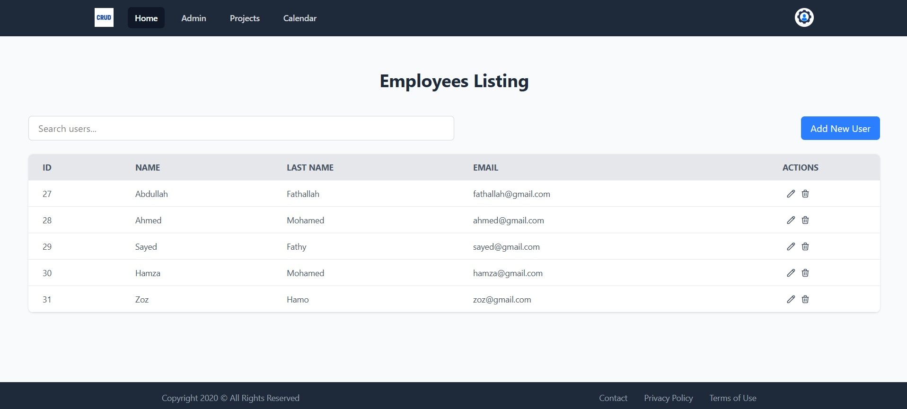

<p align="center"><a href="https://laravel.com" target="_blank"></a></p>

# Laravel CRUD - Employee Management

This is a simple Laravel 12 project that demonstrates **CRUD operations** (Create, Read, Update, Delete) for managing employee data.

## 📌 Features

- Add new employee
- View list of employees
- Update employee information
- Delete employee
- Clean UI with Tailwind CSS 




## 🚀 Getting Started

### 1. Clone the Repository

```bash
git clone https://github.com/fathallah7/Employee-Management.git
cd employee-crud
